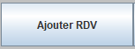
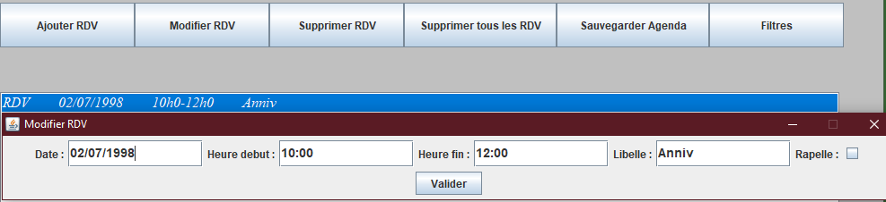

# Agenda-Java


## Getting Started

- Clone the repo and cd into the directory
```sh
git clone git@github.com:Milkad0/Agenda-Java.git
cd Agenda-Java
```

- Open the project folder
```sh
...\Agenda-Java\Swing_Agenda
```
### How it work ?






