# Agenda-Java : Never miss an appointment again !

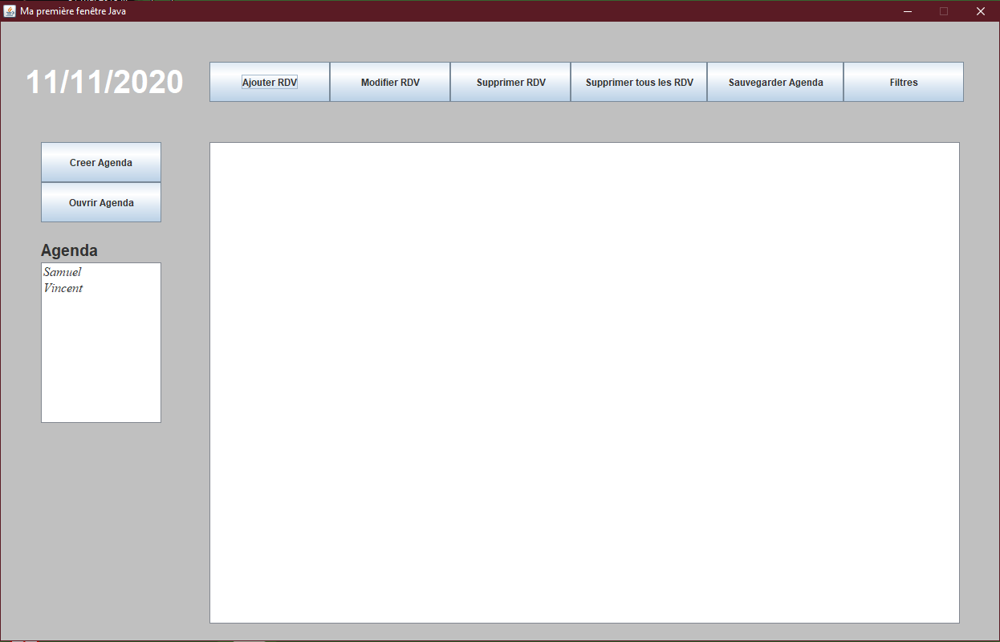

## Getting Started

- Clone the repo and cd into the directory
```sh
git clone git@github.com:Milkad0/Agenda-Java.git
cd Agenda-Java
```

- Open the project folder
```sh
...\Agenda-Java\Swing_Agenda
```
## How it work ?
### Create an agenda

To create a new agenda, click on the "Creer Agenda" button.

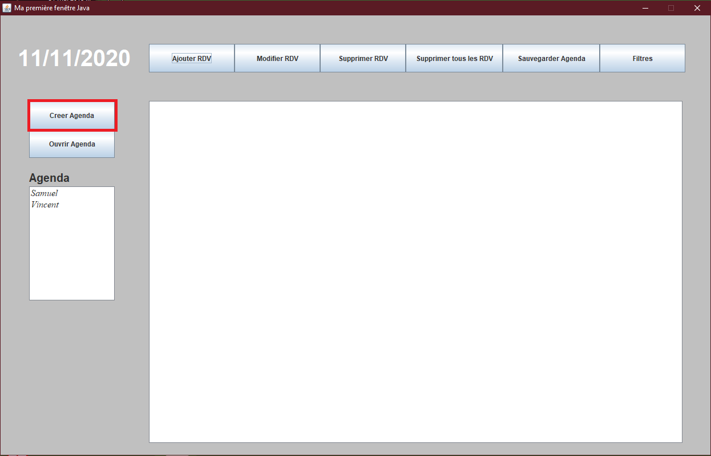

Then put the name that you want and validate

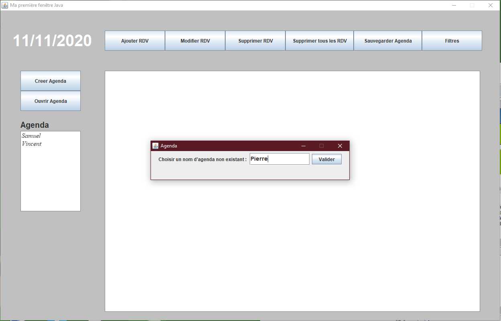

### Open an agenda

To open an agenda, you just have to select an existing one and click on "Ouvrir Agenda".

Once you have opened an agenda, you can see all the saved meetings.

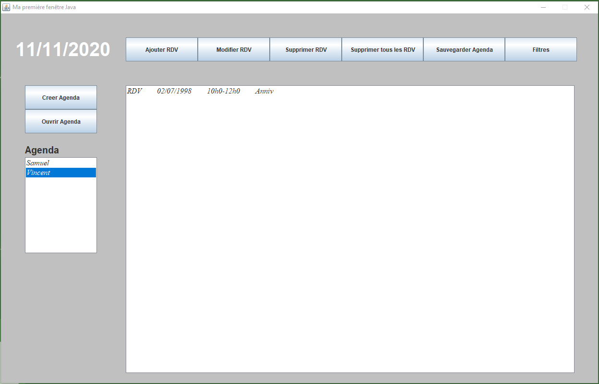

### Add a meeting

To add a meeting, click on the "Ajouter RDV" button...

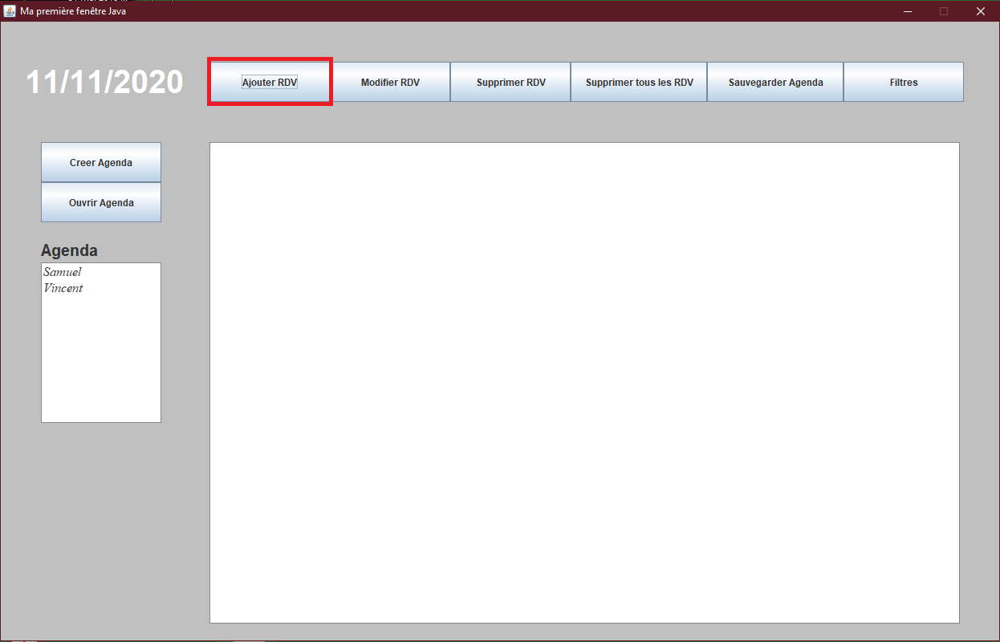

...and then fill the pop-up : [Date] [Time Start] [Time End] [Comment]

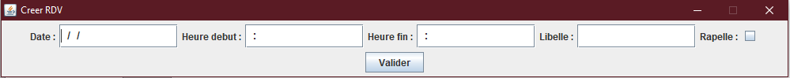

### Edit a meeting

Select a meeting, then click on the "Modifier RDV".

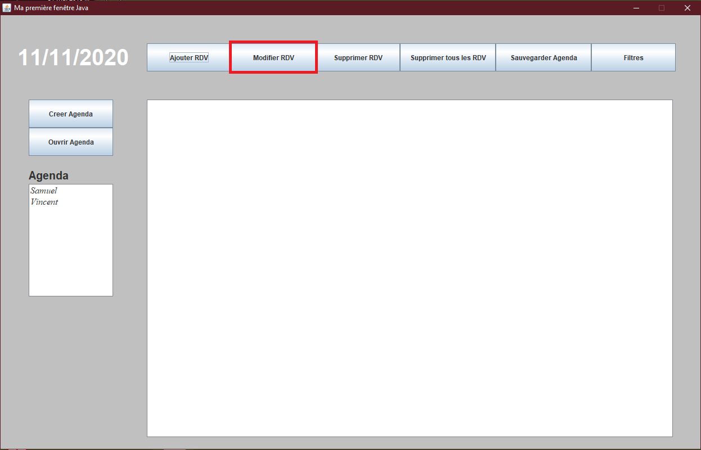

Once is done, edit the meeting informations.

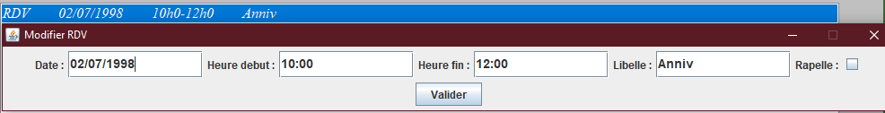

### Delete a meeting
Select a meeting, then click on the "Supprimer RDV" button.

### Delete all meetings
Just click on the "Supprimer tous les RDV" button.

### Save agenda
Click on the "Sauvegarder Agenda".

### Meetings filters
The application has 2 filters available, to use them click on the "Filtres" button.
To remove all the filters click on the "Supprimer tous les filtres" button.

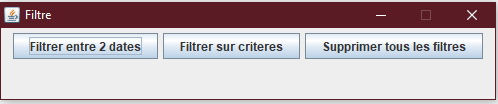

- Filter between 2 dates
Click on the "Filtrer entre 2 dates" button, and fill the fields.

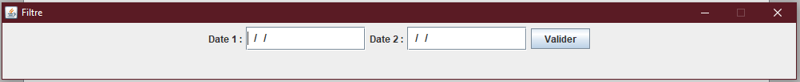

- Filter on criteria
Click on the "Filtrer sur criteres" button, and fill the fields [Day], [Month], [Year].

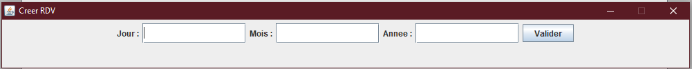

## Collaborators

Vincent ETHEVE
